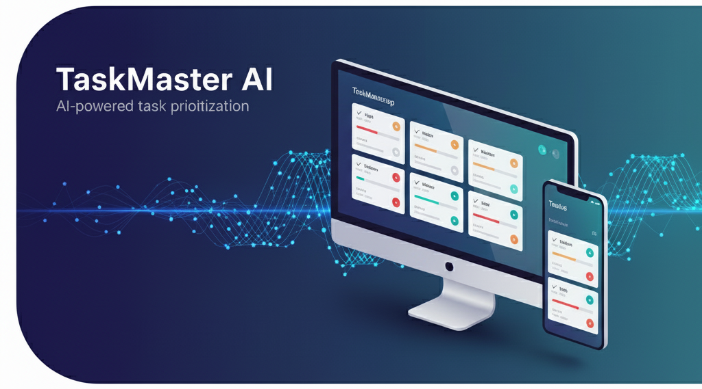
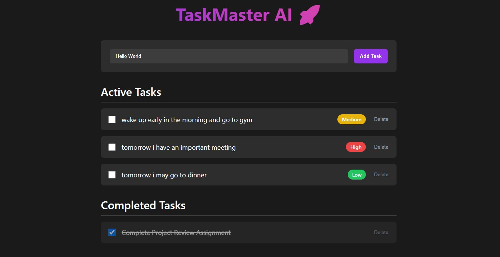

# TaskMaster AI 🚀



A modern, full-stack task management app powered by React, Node.js, Express, MongoDB, and Gemini AI for smart task prioritization.

---

## Features
- 📝 Add, complete, and delete tasks
- 🤖 AI-powered priority assignment
- 🗂️ Active and completed task sections
- 🌐 Full-stack: React frontend + Express/MongoDB backend
- 🔒 Ready for future user authentication
- ⚡ One-command startup with monorepo structure

---

## Screenshot
> Note: If images are not visible, try refreshing the page or check file names and extensions.


---


## Getting Started

### Prerequisites
- Node.js (v18+ recommended)
- npm
- MongoDB Atlas account (for database)
- Gemini AI API key (for priority AI)

### Installation
1. **Clone the repository:**
	```sh
	git clone https://github.com/gaganreddyas/taskmaster-ai.git
	cd taskmaster-ai
	```
2. **Install dependencies:**
	```sh
	npm install
	```
3. **Set up environment variables:**
	- Copy `.env.example` to `server/.env` and fill in your MongoDB URI and Gemini API key.

### Running the App
- **Start both frontend and backend:**
  ```sh
  npm start
  ```
- Frontend: [http://localhost:3000](http://localhost:3000)
- Backend API: [http://localhost:5001/api/tasks](http://localhost:5001/api/tasks)

---


## Project Structure
```
client/      # React frontend
server/      # Express backend
	models/    # Mongoose models
	routes/    # API routes
	.env       # Environment variables
images/      # Poster and screenshot images
```

---

## Environment Variables
Create `server/.env` with:
```
PORT=5001
MONGO_URI=your_mongodb_uri
GEMINI_API_KEY=your_gemini_api_key
```

---

## Deployment
- **Frontend:** Vercel, Netlify
- **Backend:** Render, Railway

---

## Contributing
Pull requests are welcome! For major changes, please open an issue first to discuss what you would like to change.

---

## License
MIT

---

## Contact
- **Author:** Gagan Reddy
- **LinkedIn:** https://www.linkedin.com/in/gagan-reddy-a-s/
---

## Notes
- This project is beginner-friendly and follows best practices for monorepo, environment management, and deployment.
- Add your own screenshots to the `images/` folder and update the README links.
- For authentication and user-specific tasks, see the roadmap in the issues section.
